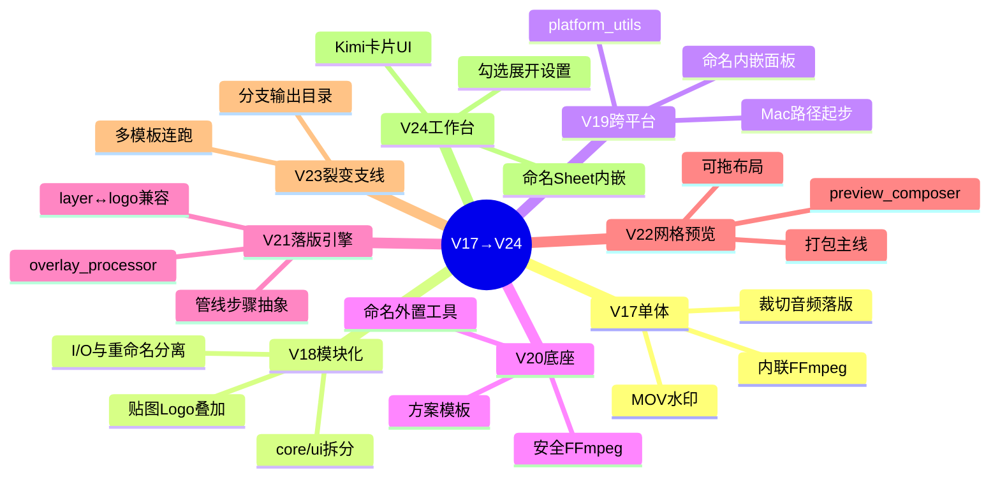
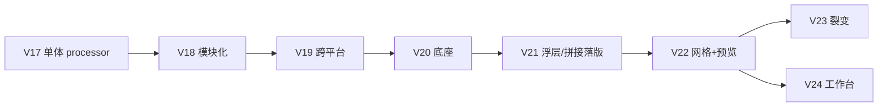

# 飞跃视频工具：V17 → V24 改动与思路

> 梳理「为什么这么做」与「踩过什么坑」，方便回看产品线决策。  
> 当前主干入口：**V22**（打包主线）｜工作台实验线：**V24**｜裂变支线：**V23**

---

## 0. 一张图看清演进





**继承关系（现代段）**

```
VideoBatchTool (V20)
 └─ VideoBatchToolV21
     └─ VideoBatchToolV22
         ├─ VideoBatchToolV23   ← 裂变（并列产品）
         └─ VideoBatchToolV24   ← 工作台（不继承 V23）
```

---

## 1. 总思路：三条产品原则

| 原则 | 含义 | 体现在 |
|------|------|--------|
| **能力可叠加、UI 可换壳** | 批处理核心尽量沉到 `core/` / `modules/`，版本文件主要改编排 | V18 起拆分；V22/V24 改布局不重写滤镜 |
| **兼容优先于推倒重来** | 模板、配置、旧变量名长期共存 | `layer_enable`↔`logo_enable`；`_on_layer_type_change` 空兼容 |
| **Windows / Mac 同逻辑不同路径** | FFmpeg、配置、图标、打包分层处理 | `platform_utils.config_path`；Mac 配置进 Application Support |

贯穿始终的批处理管线（V21 默认，V22 可按布局改序）：

```
裁切 → 比例适配 → MOV水印 → PNG水印 → 浮层落版 → 拼接落版 → 可视化叠加
```

---

## 2. 分版本：改了什么 / 为什么 / 难点

### V17 — 单体可用版（`video_batch_processor_v17.py`）

**改动要点**
- 单文件：裁切、换音频、拼接落版、MOV 循环水印、动态文字水印、源→目标改名
- FFmpeg 命令写在类里；配置落在当前工作目录

**为什么这么做**
- 先验证业务闭环：能批量出片比架构优雅更重要
- 「静雯的视频批处理工具」定位是桌面小工具，单文件好分发

**难点 / 教训**
- 水印、拼接对旋转素材、偶数宽高敏感，后期靠补丁脚本修（`_gen_diff_v17_watermark.py` 等）
- 一切耦合在一个文件里，改一处易牵全身 → 直接催生 V18 拆分

---

### V18 — 模块化重写（`video_batch_tool_v18.py`）

**改动要点**
- **全局 I/O 与重命名严格分离**（产品上最重要的交互纪律）
- 引入 `core.watermark` / `core.overlay_engine`、`ui.overlay_module`、`modules.image_composite`
- 贴图 Logo、图片合成、可视化叠加、撤销上次批处理

**为什么这么做**
- V17 把「处理视频」和「改文件名」搅在一起，用户容易误操作输出
- 叠加/水印逻辑要复用，必须从 UI 里抽出去

**难点**
- 仍是「复制式演进」而非继承：V18 是新单体，和 V17 无 `import` 关系
- FFmpeg 仍写死 `"ffmpeg"`，跨机环境脆弱

---

### V19 — 跨平台 + 命名内嵌（`video_batch_tool_v19.py`）

**改动要点**
- `modules.platform_utils`：解析 FFmpeg、配置路径、打开文件夹、默认字体
- 主界面内嵌 `NamingConventionPanel`
- `modules.output_naming`：输出文件名规则与 `unique_path`

**为什么这么做**
- 同事开始在 Mac 上用同一套工具，Windows 假设全部失效
- 命名规范是日常刚需，内嵌能减少「跑完再开另一个程序」的摩擦

**难点**
- 一个窗口塞视频模块 + 命名面板 → 界面膨胀、职责模糊
- 配置从「当前目录 json」迁到 `config_path(...)`，旧用户路径要迁移意识

---

### V20 — 现代底座（`video_batch_tool_v20.py`）

**改动要点**
- **方案模板**（保存/加载整套开关与参数）
- **命名外置**为 `naming_tool.py`（主程序只保留入口）
- `core.ffmpeg_safe`：安全跑 FFmpeg、探测、原子发布成品
- 去掉动态文字水印；强化画布叠加

**为什么这么做**
- 模板：同一套「某品牌 9:16 + 落版」要反复用，手勾太慢
- 命名规则复杂（品牌/语言/标签/旧版清理），塞进视频工具会互相拖累发版
- 批处理崩溃时需要可诊断的安全封装，而不是裸 `subprocess`

**难点**
- 「内嵌 → 外置」是一次产品取舍：操作步骤变多，但发布边界清晰
- 模板字段会随版本增减 → 后续 V21/V22 大量兼容胶水（见下）

---

### V21 — 浮层落版引擎（`video_batch_tool_v21.py` ← V20）

**改动要点**
- 新引擎 `core.overlay_processor`：结尾覆盖落版、贴图、几何探测、时间轴
- UI：浮层落版 + 保留「拼接落版（旧版）」双模式
- 管线抽象：`_batch_pipeline_order` / `_run_batch_step` / `_batch_step_enabled`
- 主题皮肤、`conflict_mode`（覆盖 / 改名 / 跳过）
- 配置 `video_batch_config_v21.json`（可从 higo 配置迁移）

**为什么这么做**
- 业务从「拼到片尾」升级到「结尾覆盖 + 可保留落版音」
- 步骤必须可开关、可排序，否则后面任何 UI 重排都会打乱批处理

**难点（高）**
1. **音视频时间轴**  
   - 曾用 `-itsoffset`，主片有声时落版音易丢；后改为 **视频 `setpts` + 音频 `adelay` + `amix normalize=0`**  
   - 必须区分：主片无声 → 一定保留落版音；主片有声 → 按勾选混音
2. **双变量兼容**  
   - UI：`layer_enable`；批处理历史字段：`logo_enable`  
   - 靠 `_sync_layer_to_legacy` / `_infer_layer_from_legacy` 双向对齐
3. **模板兼容**  
   - V20 模板仍调 `_on_layer_type_change` → V21 已无该 UI，必须补空实现，否则 V22 一加载模板就崩

---

### V22 — 网格布局 + 预览画布（`video_batch_tool_v22.py` ← V21）

**改动要点**
- 3×3 模块网格，用户可改位置；**批处理顺序跟随布局行列**
- 中间「视频预览画布」：`core.preview_composer` 合成叠层示意
- 可视化叠加进网格；布局编辑器；年度工具年报入口
- **当前 Windows / Mac 打包主入口**

**为什么这么做**
- 「看得到再批处理」降低返工：裁切/水印/比例要在帧上对位置
- 不同同事习惯不同模块顺序 → 布局可配比写死 UI 更耐用

**难点**
- 布局隐藏某模块时，`build_*_section` 不跑 → `cut_enable` 等变量不存在  
  → 引出 `_ensure_core_config_vars()`：**配置/批处理依赖的变量启动前必须建好**
- 预览与真实 FFmpeg 滤镜不完全等价，只能「示意 + 抽帧」，不能当最终成片保证
- Mac 打包：`.app` 内写配置只读失败 → 配置改到 `~/Library/Application Support/HabiVideoTool/`

---

### V23 — 批量裂变支线（`video_batch_tool_v23.py` ← V22）

**改动要点**
- 每一行分支 = 一套模板工作流
- 输出到 `{输出根}/{分支名}/`，再可选重编号接共享盘序号
- `modules.fission_engine` 管理方案

**为什么这么做**
- 同一批素材要出多语言 / 多尺寸 / 多落版组合，人工换模板太慢
- 与「单次工作台体验」是不同场景，所以做成**并列分支**，不塞进 V24

**难点**
- 分支配置与当前界面状态的快照/引用要清晰，否则「以为改了 UI 却跑的是旧模板」
- 与 V24 互不继承：发版时要记住「裂变」和「工作台」是两条线

---

### V24 — Kimi 风格工作台（`video_batch_tool_v24.py` ← V22）

**改动要点**
- 视觉：浅灰底 `#F2F2F7` + 白卡片悬浮 + 留白（`ui/workbench_skin.py`）
- 交互：左侧勾选 → 中间只展开已启用设置（去掉 Tab 二次点击）
- 顶栏双 Sheet：**视频批处理 | 规范命名**（内嵌 `NamingToolApp`）
- 处理链路可视化；可点击跳转；文件树单击预览；命名页带入输出文件夹
- 模板/配置加载后强制同步面板 + 浮层变量对齐

**为什么这么做**
- V22 功能全但「表格感」重：模块贴边、操作路径长、命名还要另开 exe
- 用户反馈核心是 **呼吸感 + 链路闭合**：勾选要有中间反应；视频跑完要顺手命名

**难点**
1. **不重写引擎，只换壳**  
   - 必须继续 `_mount_builder` 调用 V21 的 `build_*_section`，否则行为分叉
2. **双开关噪声**  
   - 左侧勾选 + 卡片「启用」重复 → 已改为只留左侧
3. **连接断层（已修）**  
   - 加载模板不刷新中间区；命名默认输入目录而非输出目录；链路条只能看不能点
4. **Tk 无真毛玻璃/大圆角**  
   - 用留白 + 1px 淡边框 + 浅灰底「模拟」卡片感，不是 Web 级视觉

---

## 3. 横向专题：反复出现的难点

### 3.1 配置 / 模板 vs UI 生命周期

```
启动 → ensure 变量 → 建 UI（可能重建 BooleanVar）→ load_config
布局隐藏模块 → 控件未创建，但批处理仍要读 enable 变量
加载旧模板 → 调用已删除的回调名
```

**对策**：`_ensure_core_config_vars`、兼容空方法、加载后 `_after_config_loaded` / `_sync_feature_panels`

### 3.2 浮层落版音频

| 场景 | 期望 | 实现要点 |
|------|------|----------|
| 主片无声 + 落版有声 | 必须有落版音 | 不依赖「保留落版音频」勾选 |
| 主片有声 + 勾选保留 | 重叠段混音 | `adelay` + `amix=normalize=0` |
| 曾用 `-itsoffset` | 易音画不同步/落版音丢失 | 改为 `setpts` 推画面 |

### 3.3 Mac 打包与配置写盘

- 配置写进 `.app/Contents` → 只读崩溃或丢配置  
- 正确位置：`~/Library/Application Support/HabiVideoTool/`  
- Windows 同事下 zip **不能**替代 Mac 重打 app；Mac 需用 `20260716Mac打包准备2` + `build_mac.sh`

### 3.4 命名工具边界

| 阶段 | 策略 | 原因 |
|------|------|------|
| V19 | 内嵌面板 | 减少切换 |
| V20–V22 | 独立 exe | 规则复杂、发版解耦 |
| V24 | Sheet 再内嵌 | 工作台要闭环，但不改命名核心逻辑 |

### 3.5 继承链过深

`V24 → V22 → V21 → V20`，UI 覆盖容易漏调 `super` 或漏挂 `progress` / `log`。  
原则：**逻辑向下沉，版本文件只做编排与兼容。**

---

## 4. 能力落点速查

| 能力 | 主要位置 | 主用版本 |
|------|----------|----------|
| MOV 水印 | `core/watermark.py` | V18+ |
| 画布叠加 | `core/overlay_engine.py` | V18–V20 |
| 浮层/落版滤镜 | `core/overlay_processor.py` | V21+ |
| 安全 FFmpeg | `core/ffmpeg_safe.py` | V20+ |
| 预览合成 | `core/preview_composer.py` | V22+ |
| 平台路径 | `modules/platform_utils.py` | V19+ |
| 规范命名 | `modules/naming_convention.py` + `naming_tool.py` | V19→V20 外置→V24 内嵌 |
| 裂变 | `modules/fission_engine.py` | V23 |
| 工作台皮肤 | `ui/workbench_skin.py` | V24 |

---

## 5. 现在该用哪个版本？

| 场景 | 建议 |
|------|------|
| 日常批处理 / 对外打包 | **V22**（稳定主线） |
| 多模板连跑多分支输出 | **V23** |
| 尝鲜工作台 UX、同一窗口命名 | **V24**（能力基于 V22，UI 仍在打磨） |
| 查历史单体逻辑 | V17–V19 留档对照，不再作为主入口 |

---

## 6. 一句话总结

> **V17 证明能出片 → V18/V19 拆模块、上跨平台 → V20 立住模板与安全底座 → V21 攻克落版音画 → V22 用网格+预览把「看见再批」做实（打包主线）→ V23/V24 分别服务「多方案裂变」与「工作台闭环」，共享引擎、分叉体验。**

难点主线始终是三件事：**旧模板兼容、FFmpeg 音画时间轴、跨平台写配置**；UI 改版的正确姿势是换壳不断芯。
