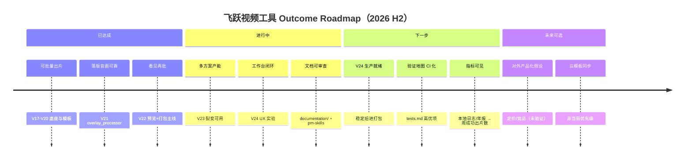
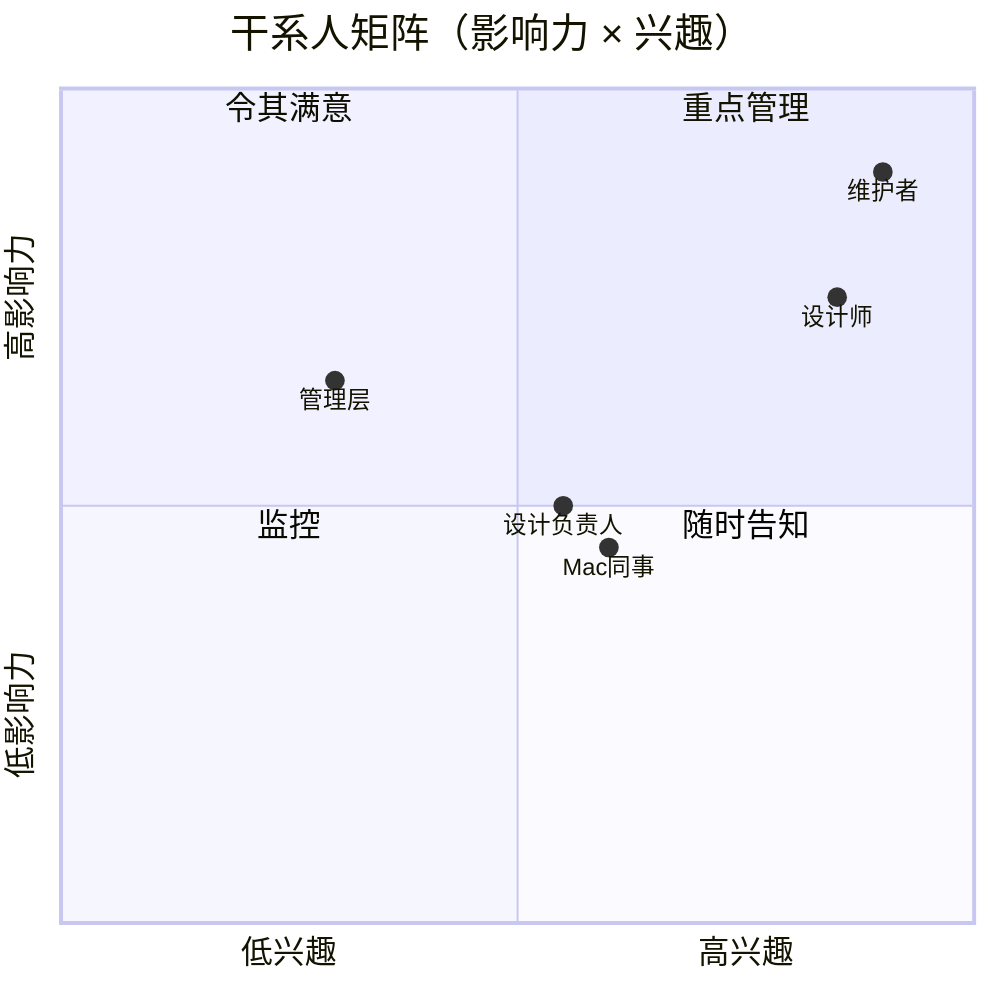

# PM Skills Full Run — 飞跃视频工具

> 执行类 Skills 全量运行结果 · 产品：内部桌面批处理（裁切/水印/落版/叠加/命名）  
> 主线 V22 · 支线 V23 裂变 · 实验 V24 工作台  
> 生成日期：2026-07-22

---

## create-prd

### PRD — 飞跃视频工具（整体产品）

#### 1. Summary（摘要）

飞跃视频工具是面向内部素材/投放团队的桌面批处理应用，将裁切、比例适配、MOV/PNG 水印、浮层落版、可视化叠加与规范命名串成可复用的「方案模板」流水线。当前生产主线为 **V22**；V23 服务多模板裂变产能，V24 探索工作台式闭环 UX。本 PRD 描述整体产品意图，而非单一版本功能清单。

#### 2. Contacts（干系人）

| 姓名/角色 | 职责 | 备注 |
|-----------|------|------|
| 产品/维护负责人 | 版本策略、模板规范、文档对齐 | 决策 V22 为打包主线 |
| 素材/投放设计师 | 日常批处理、模板使用、反馈 UX | 主要用户 |
| 设计负责人/规范管理员 | 命名规则、模板库治理 | 命名工具深度用户 |
| Mac 协作者 | Mac 打包、Application Support 配置验证 | 跨平台分发 |
| 工程维护者 | FFmpeg 滤镜、兼容层、PyInstaller 打包 | 无专职后端 |

#### 3. Background（背景）

- **现状**：团队每天对同一批投放素材重复执行裁切、9:16、水印、落版等工序；Premiere 手搓慢且易漏步骤；共享盘文件名不统一导致对不上号。
- **为什么现在**：V17–V21 已验证业务闭环并攻克落版音画；V22 网格预览进入打包主线；V24 工作台响应「呼吸感 + 命名闭环」反馈；文档与 PACKAGING 仍滞后于 V22，需产品层统一叙事。
- **新可能**：模块化 core + 模板 JSON 使「能力可叠加、UI 可换壳」成为可持续演进模式，不必每次推倒重写。

#### 4. Objective（目标）

**目标**：让素材团队以「加载一套方案 → 批量出片 → 规范命名 → 一次交盘」替代逐条手搓，并将失败率与返工控制在可接受范围。

**对公司/用户价值**：
- 产能：缩短单批次处理时间，支持 V23 多方案连跑
- 质量：预览示意 + 落版音画规则减少「批完才发现错」
- 协作：Win/Mac 同逻辑、命名规范统一

**关键结果（OKR 草案）**：

| KR | 目标 | 度量 |
|----|------|------|
| KR1 | 周成功出片数提升 | 一次批处理成功输出文件数 / 周（日志或年报统计） |
| KR2 | 新同事 30 分钟上手 | 选文件夹 → 加载模板 → 出 1 条片，无阻塞工单 |
| KR3 | 批处理失败率下降 | 失败文件数 / 总处理数 < 5%（按模块归因） |
| KR4 | 落版音丢失工单归零 | 主片无声场景 100% 保留落版音（回归测试覆盖） |
| KR5 | 文档与打包主线一致 | PACKAGING / README 口播统一到 V22 |

#### 5. Market Segment(s)（市场细分）

| 细分 | 问题/约束 | 产品约束 |
|------|-----------|----------|
| **Beachhead：投放素材设计师** | 多语言/多尺寸/带落版短视频批量出片 | 需 FFmpeg 可用；模板字段需培训 |
| **规范管理员** | 统一命名与模板，减少覆盖错文件 | 命名规则复杂 → 独立工具或 V24 内嵌 |
| **Mac/Win 协作者** | 同一套包能开、能配、能更新 | Mac 配置必须在 Application Support，不能写 .app 内 |
| **多方案产能用户（V23）** | 同一批素材出多套组合 | 分支输出目录清晰，模板引用不静默错位 |

市场由 **Jobs-to-be-done** 定义，而非 demographics。

#### 6. Value Proposition(s)（价值主张）

| 用户要完成的事 | 获得 | 避免的痛苦 | 相对剪辑软件 |
|----------------|------|------------|--------------|
| 批量加落版/水印 | 可开关管线 + 方案模板 | 一条条时间线对齐 | 工序固化，不拼创意剪辑 |
| 成片进共享盘 | 规范命名 + 同名策略 | 覆盖错文件、序号乱 | 命名闭环是差异点 |
| 预览再批 | V22 预览画布 / V24 勾选展开 | 批完才发现位置错 | 示意预览，非像素级保证 |
| 多方案连跑 | V23 裂变 | 反复换模板手跑 | 旁路产品，不合并主线 |

**UVP**：「方案模板一次配好，文件夹拖进去就出片」——专为投放素材批处理，不是通用 NLE。

#### 7. Solution（方案）

**7.1 UX / 用户流**

- F1 标准批处理：输入/输出 → 加载模板 → 配置模块 → （可选）预览 → 批处理 → （可选）命名
- F2 模板保存/加载：JSON 合同跨版本，加载后 UI 与批处理一致
- F3 浮层落版：结尾覆盖；主片无声必保留落版音
- F4 命名：字段化 + 标签库 + 旧版清理
- F5 裂变（V23）：多行模板 → 分支子目录输出
- F6 工作台（V24）：三栏 + 双 Sheet（视频 | 命名）

**7.2 关键功能**

| 模块 | 说明 | 版本 |
|------|------|------|
| 裁切 / 比例 / MOV·PNG 水印 | 管线步骤可开关、可排序 | V18+ |
| 浮层落版 / 拼接落版 | overlay_processor 音画对齐 | V21+ |
| 可视化叠加 | 画布编辑器 | V18+ |
| 方案模板 | 保存/加载整套参数 | V20+ |
| 预览画布 | 抽帧示意，非成片保证 | V22+ |
| 3×3 网格布局 | 顺序影响管线 | V22 |
| 裂变引擎 | 多模板连跑 | V23 |
| 工作台皮肤 + 命名 Sheet | Kimi 风格闭环 | V24 |
| 规范命名工具 | 独立 exe 或 V24 内嵌 | V19→V24 |

**7.3 技术（摘要）**

- Python 3 + Tkinter/ttkbootstrap；FFmpeg/FFprobe；PyInstaller 打包
- 核心沉于 `core/`（ffmpeg_safe、watermark、overlay_processor、preview_composer）
- 配置 JSON 版本化；Mac 经 `platform_utils.config_path` 写 Application Support

**7.4 假设（待验证）**

- 预览画布「示意足够」可降低返工至可接受水平
- V24 稳定后可进打包主线且不引入行为分叉
- 模板 JSON 作为跨版本合同可长期维持（需兼容层）
- 内部 U 盘/网盘分发足以覆盖协作，无需 SaaS

#### 8. Release（发布规划）

| 阶段 | 范围 | 相对时间 |
|------|------|----------|
| **已发布·生产** | V22 网格预览 + 预览画布；Win/Mac 打包主线 | 当前默认 |
| **旁路·可用** | V23 裂变；V24 工作台（bat 启动，未进 build） | 现在 |
| **下一版·稳定化** | V24 UX 打磨；`_after_config_loaded` 等连接问题收敛；补测试 | 1–2 个迭代 |
| **打包对齐** | V24 进 `build_windows.bat` / Mac spec；PACKAGING 改口 V22 | V24 稳定后 |
| **未来** | 本地埋点/周报指标产品化；CI 门禁关键规则 | 3+ 迭代 |

首版不做：对外 SaaS、账号体系、云模板同步、通用剪辑能力。

---

## user-stories

Epic 按用户角色组织；验收标准面向可演示行为。

### Epic A — 日常批处理（设计师）

| ID | Story | 验收标准 |
|----|-------|----------|
| US-A1 | 作为设计师，我想选择输入/输出文件夹并设置同名策略，以便批量处理时不误覆盖 | 三种 conflict_mode 生效；日志记录跳过/改名 |
| US-A2 | 作为设计师，我想加载方案模板一键恢复参数，以便不用每次手勾 | 模板列表可选；加载后开关与路径策略可询问 |
| US-A3 | 作为设计师，我想在预览画布上看裁切/水印/比例示意，以便批处理前发现明显错误 | 抽帧显示；与成片有已知偏差需文档说明 |
| US-A4 | 作为设计师，我想按模块开关裁切→比例→水印→落版→叠加，以便只跑需要的工序 | 禁用模块不参与 FFmpeg；顺序随 V22 布局 |
| US-A5 | 作为设计师，我想看到彩色模块日志和失败列表，以便定位哪条片出错 | failed_files 可复查；不静默吞错 |

### Epic B — 落版与音画（设计师）

| ID | Story | 验收标准 |
|----|-------|----------|
| US-B1 | 作为设计师，我想主片无声时落版音一定保留，以便结尾有声 | 不依赖「保留落版音频」勾选 |
| US-B2 | 作为设计师，我想主片有声且勾选保留时重叠段混音，以便不丢主片音 | adelay + amix normalize=0 |
| US-B3 | 作为设计师，我想浮层落版在片尾覆盖画面，以便符合投放落版规范 | setpts 对齐，不用 -itsoffset |

### Epic C — 规范命名（设计师 / 管理员）

| ID | Story | 验收标准 |
|----|-------|----------|
| US-C1 | 作为设计师，我想按品牌/语言/类型/标签生成文件名，以便共享盘可检索 | build_filename 输出符合模板 |
| US-C2 | 作为管理员，我想维护标签库与旧版清理规则，以便历史文件可批量整理 | 保留词/剔除词预览正确 |
| US-C3 | 作为 V24 用户，我想批处理完成后命名 Sheet 默认指向输出文件夹，以便闭环改名 | 不带入输入源目录 |

### Epic D — 多方案产能（V23 用户）

| ID | Story | 验收标准 |
|----|-------|----------|
| US-D1 | 作为设计师，我想一次配置多行模板连跑，以便同一批素材出多语言/多尺寸 | 每分支输出到 `{根}/{分支名}/` |
| US-D2 | 作为设计师，我想裂变前确认每行绑定的模板快照，以免 UI 改了却跑旧模板 | 方案保存/加载清晰 |

### Epic E — 跨平台与打包（协作者 / 维护者）

| ID | Story | 验收标准 |
|----|-------|----------|
| US-E1 | 作为 Mac 用户，我想配置写在 Application Support，以便 .app 只读不崩 | config_path 可写 |
| US-E2 | 作为同事，我想双击 `飞跃视频工具.exe` 即用内置 FFmpeg，以便无需装环境 | 打包清单完整 |
| US-E3 | 作为维护者，我想加载 V20 旧模板不崩溃，以便模板库可迁移 | `_on_layer_type_change` 等兼容 |

---

## job-stories

采用 Job Story 格式：**When … I want to … so I can …**

| # | Job Story | 对应能力 |
|---|-----------|----------|
| J1 | 当我收到一批待投放 raw 片时，我想勾一套已验证的方案模板并一键批处理，以便下班前交盘而不是逐条 Premiere | 方案模板 + 管线批处理 |
| J2 | 当落版位置在片尾 2 秒时，我想在预览里看见水印和比例框，以便不用批完 50 条才发现偏了 | V22 preview_composer |
| J3 | 当主片没有音轨但落版有 BGM 时，我想成片自动带出落版音，以便投放平台不判「无声素材」 | overlay_processor 无声主片规则 |
| J4 | 当同一文件夹要出中/英/日三套落版时，我想裂变连跑而不是换三次模板，以便产能翻倍 | V23 fission_engine |
| J5 | 当视频批处理刚结束，我想在同一窗口切到命名页且目录已是输出文件夹，以便 5 分钟内文件名进共享盘规范 | V24 双 Sheet |
| J6 | 当 Mac 同事第一次打开 .app 时，我想配置自动落到用户目录，以便不会因为只读包内写 json 而闪退 | platform_utils |
| J7 | 当加载去年存的 V20 模板时，我想程序不崩且浮层开关正确，以便规范管理员不用重配一遍 | 模板兼容层 |
| J8 | 当输出目录已有同名文件时，我想明确选择跳过/改名/覆盖，以便不会默默盖掉同事的好片 | conflict_mode + unique_path |

---

## wwas

**WWAS = What · Why · Alternatives · Success**

| 决策点 | What（做什么） | Why（为什么） | Alternatives（备选） | Success（成功标准） |
|--------|----------------|---------------|----------------------|---------------------|
| 打包主线选 V22 而非 V24 | 生产默认 V22 exe/app | V22 网格+预览已验证；V24 UI 仍在打磨 | 直接推 V24；维持 V21 HIGO | 同事默认 bat/exe 指向 V22；工单不增 |
| 命名工具外置 vs 内嵌 | V20–V22 外置；V24 Sheet 内嵌 | 规则复杂需独立发版；工作台要闭环 | 永远内嵌；永远双 exe | 命名发版不阻塞视频；V24 闭环可用 |
| 预览画布定位 | 抽帧示意，非像素级 | 降低返工成本；全滤镜预览成本过高 | 不做预览；强制 3 秒试跑成片 | 返工率下降；用户理解「示意≠成片」 |
| 落版音画方案 | setpts + adelay + amix | -itsoffset 曾致落版音丢失 | 继续 itsoffset；一律重编码整轨 | 无声主片 100% 落版音；有声混音可接受 |
| Mac 配置路径 | Application Support | .app 内只读 | 写当前目录；写包内 Resources | Mac 首次启动无写盘崩溃 |
| V23/V24 不互继承 | 并列旁路挂 V22 能力 | 场景不同：裂变 vs 工作台 | 合并为一个 mega 版本 | 两条线可独立迭代不互相拖死 |
| 模板 JSON 作跨版本合同 | 字段增减靠兼容胶水 | 用户模板库是组织资产 | 每版 breaking change | 旧模板加载成功率 > 95% |

---

## sprint-plan

**假设 2 周迭代 · 团队 = 1 维护者 + 设计师代表**

### Sprint Goal

「V24 连接稳定性 + 文档/打包对齐 V22 + 落版音回归不回归」

### Sprint Backlog（优先级序）

| 优先级 | 项 | 估点 | 负责人 |
|--------|-----|------|--------|
| P0 | 修复/验证 V24 `_after_config_loaded` 全模块同步 | 3 | 工程 |
| P0 | `test_endcard_geometry` 扩展：无声主片 + 有声混音两路径 | 2 | 工程 |
| P0 | 更新 PACKAGING.md：HIGO → V22 飞跃视频工具 | 1 | PM/工程 |
| P1 | `_ensure_core_config_vars` 单元测试（隐藏模块 load_config） | 2 | 工程 |
| P1 | V24 命名 Sheet 默认输出路径 — 验收脚本 | 1 | 设计师+工程 |
| P1 | Mac config_path mock 测试 | 2 | 工程 |
| P2 | V23 裂变：模板引用快照说明 + UI 提示 | 2 | PM+工程 |
| P2 | 文档索引页补 pm-skills-full-run 链接 | 1 | PM |

### 不纳入本 Sprint

- V24 进 PyInstaller 主线（待 P0 稳定 1 迭代）
- 北极星埋点产品化
- 新功能：替换音频回归

### Definition of Done

- 相关测试绿或手工验收记录
- documentation/ 与行为一致处已更新
- 设计师代表跑通 F1+F4 一次

---

## outcome-roadmap

按 **Outcome（结果）** 而非功能列表排期。



| 时间框 | Outcome |  leading 指标 |  lagging 指标 |
|--------|---------|---------------|---------------|
| 现在 | 同事默认用 V22 稳定出片 | 启动脚本点击率 | 批处理失败率 |
| +1 迭代 | V24 体验达「愿日常用」 | V24 会话时长、命名 Sheet 使用率 | V24 相关工单 |
| +2 迭代 | 文档=打包=入口一致 | PACKAGING 审计通过 | 错打包工单 = 0 |
| +3 迭代 | 关键规则有自动回归 | CI 测试数 | 落版音/模板崩溃 = 0 |

---

## prioritization-frameworks

对当前 backlog 用三种框架交叉验证。

### RICE（示例项）

| 项 | Reach | Impact | Confidence | Effort | Score |
|----|-------|--------|------------|--------|-------|
| PACKAGING 改 V22 | 8（全员） | 2 | 0.9 | 1 | 14.4 |
| 落版音回归测试 | 6 | 3 | 0.85 | 2 | 7.65 |
| V24 进打包 | 5 | 3 | 0.6 | 5 | 1.8 |
| 预览=成片像素级 | 4 | 2 | 0.4 | 8 | 0.4 |
| 北极星埋点 | 3 | 2 | 0.7 | 3 | 1.4 |

**结论**：文档对齐与回归测试 ROI 最高；像素级预览 Effort 过大且 Confidence 低，延后。

### MoSCoW（下一发布）

| Must | Should | Could | Won't（本季） |
|------|--------|-------|---------------|
| V22 打包文档正确 | V24 连接 bug 修完 | 年报指标美化 | SaaS 账号 |
| 旧模板加载不崩 | 裂变 UI 提示 | V24 进打包 | 云同步模板 |
| 落版音规则回归 | Mac config 单测 | resolve V24 启动器 | 替换音频回归 |

### Kano（功能分类）

| 类型 | 功能 | 说明 |
|------|------|------|
| 基本型 | 批处理出片、FFmpeg 可用、不崩 | 缺失即不可用 |
| 期望型 | 模板、预览、命名、同名策略 | 竞品（手搓/脚本）也有近似物 |
| 魅力型 | V23 裂变、V24 工作台、年度年报 | 超预期产能与体验 |
| 无差异 | 多套皮肤主题 | 不影响选型 |
| 反向 | 双开关（V24 已去）、动态文字水印（已移除） | 增加噪声 |

---

## brainstorm-okrs

**Objective O1**：让飞跃视频工具成为素材团队「默认出片流水线」

| Key Result | 基线 | 目标 | 度量方式 |
|------------|------|------|----------|
| KR1 周成功出片数 | 未系统化 | +30% | 日志解析 / 年报 |
| KR2 新同事上手时间 | ~60min（估） | ≤30min |  onboarding 实测 |
| KR3 批处理失败率 | 未量化 | <5% | failed/total |
| KR4 模板相关崩溃 | 偶发 | 0 次/月 | 工单+日志 |

**Objective O2**：缩小「意图 vs 实现」文档债

| Key Result | 基线 | 目标 |
|------------|------|------|
| KR1 PACKAGING 与主线一致 | 写 HIGO/V20 | 100% V22 |
| KR2 tests.md 高优项有自动化 | 2 个 py 测试 | +4 单测 |
| KR3 已知风险在 architecture 有据 | 部分 | 6/6 风险有代码引用 |

**Objective O3**：V24 工作台达到可进打包门槛（实验线）

| Key Result | 基线 | 目标 |
|------------|------|------|
| KR1 设计师 NPS（内部 5 人） | 未测 | ≥4/5 |
| KR2 命名闭环一步完成率 | 部分路径错目录 | 100% 默认输出目录 |
| KR3 P0 连接 bug | 若干 | 0 open |

---

## release-notes

### V22 — 飞跃视频工具（打包主线 · 推荐日常使用）

**新功能**
- **3×3 模块网格**：拖拽排列裁切、比例、水印、落版、叠加等模块；批处理顺序跟随你的布局。
- **视频预览画布**：处理前可抽帧查看裁切、比例与水印位置示意，减少批量返工。
- **可视化叠加进网格**：叠加编辑与预览在同一工作区完成。
- **布局编辑器**：保存习惯的模块排布。
- **年度工具年报**（实验）：查看使用统计摘要。

**改进**
- 方案模板与 V21 落版引擎完整继承；浮层落版音画对齐更稳定。
- Windows / Mac 双端打包入口统一为 V22。

**已知限制**
- 预览画布为示意合成，与最终 FFmpeg 成片可能存在像素级差异，请以短片段试跑或首批抽检为准。
- Mac 首次使用请将配置写入 `~/Library/Application Support/HabiVideoTool/`，勿手动改 .app 包内文件。

**升级建议**：日常批处理与对外分发请使用 V22；旧 HIGO/V21 入口仅作归档对照。

---

### V23 — 裂变模式（多模板连跑 · 实验）

**新功能**
- **裂变方案表**：每一行绑定一套模板，一次运行按顺序批处理多分支。
- **分支输出目录**：成片自动落入 `{输出根}/{分支名}/`，便于多语言/多尺寸并行交付。
- **可选重编号**：对接共享盘序号习惯。

**适用场景**
- 同一批 raw 素材需出多套落版/水印/比例组合，不想反复手动换模板。

**已知限制**
- 与 V24 工作台互不继承；请确认每行模板引用为最新保存版本，避免「界面已改、裂变仍跑旧模板」。
- 未纳入默认 exe 打包，通过 `启动V23最新版.bat` 启动。

**升级建议**：多方案产能场景选用 V23；单次工作台体验请用 V22 或 V24。

---

### V24 — 批处理工作台（Kimi 风格 · 实验预览）

**新功能**
- **三栏工作台**：左侧功能勾选清单 · 中间设置与处理链路 · 右侧输出与进度。
- **勾选即展开**：启用模块后中间区自动展示对应设置，减少 Tab 二次点击。
- **顶栏双 Sheet**：**视频批处理 | 规范命名** — 批处理完成后可切到命名页，默认带入输出文件夹。
- **处理链路可视化**：可点击跳转到对应模块设置。
- **文件树单击预览**：快速核对输入素材。

**改进**
- 浅灰底 + 白卡片视觉（`workbench_skin`）；加载模板/配置后强制同步面板与浮层变量。

**已知限制**
- **尚未进入打包主线** — 请用 `启动V24工作台.bat` 体验；稳定后将并入 build 脚本。
- Tk 界面为「卡片感模拟」，非 Web 级毛玻璃效果。
- 能力基于 V22 引擎，UI 换壳；若发现行为与 V22 不一致请报 bug。

**升级建议**：追求闭环 UX 与命名同屏者可尝鲜 V24；生产交付仍建议 V22，待 V24 进打包后再切换默认入口。

---

## retro

**迭代主题**：V24 工作台首轮内测 + 文档 pm-skills 整理  
**参与者**：维护者、2 名设计师、1 名 Mac 协作者

### Keep（继续保持）

- **引擎下沉、版本只编排**：V24 换壳不重写 FFmpeg，bug 面可控。
- **模板 JSON 作组织资产**：同事愿意共享方案，减少重复配参。
- **演进文档**（`V17到V24演进思路.md`）对 onboard 新人极有价值。
- **无声主片落版音规则**写进 overlay_processor，减少玄学工单。

### Problem（问题）

- PACKAGING 仍写 HIGO，Mac 同事按旧文档打包浪费时间。
- 预览≠成片未在所有入口醒目提示，仍有「按预览批完偏 5px」反馈。
- V24 早期「双开关」造成困惑（已改，但测试覆盖不足）。
- 无 CI，回归靠人工；模板兼容 bug 易复发。

### Try（下次尝试）

- 每个迭代固定 1 个「文档债」项（本迭代 PACKAGING）。
- tests.md 高优 2 项进仓库，PR 必跑。
- V24 内测 checklist：加载模板 → 批 3 条 → 命名 Sheet 路径。
- 设计师反馈用统一表单：模块 / 模板名 / 是否 Mac。

---

## pre-mortem

**项目**：V24 工作台进入打包主线并成为默认入口  
**假设发布时点**：2 个迭代后

### 想像失败：发布后 2 周工单爆炸

| 失败模式 | 早期信号 | 预防措施 |
|----------|----------|----------|
| 加载旧模板崩溃 | V20 模板在 V24 复测不足 | 模板兼容性单测 + 10 份真实模板回归 |
| 落版音再次丢失 | 新 UI 路径未走 overlay_processor | 禁止版本文件复制滤镜逻辑；回归 test_endcard_geometry |
| Mac 配置写 .app 闪退 | 新入口绕过 platform_utils | Mac 打包 smoke + config_path 单测 |
| 命名 Sheet 指向输入目录 | 回归 V24 闭环 bug | 自动化断言 output_dir |
| 同事仍按 PACKAGING 打 HIGO 包 | 文档未同步 | 发布门禁：文档审计 checklist |
| V24 与 V22 行为分叉 | _mount_builder 漏挂 | 同输入同模板 V22/V24 输出 hash 对比（抽样） |
| 预览误导导致批量返工 | 用户以为预览=成片 | 发布说明 + UI 常驻提示 |
| 打包体积/FFmpeg 路径错误 | spec 未更新 | Win/Mac 各 1 台干净机验收 |

###  Go / No-Go 清单（发布前）

- [ ] 10 份生产模板 V24 加载成功
- [ ] 落版音 3 场景视频人工听检通过
- [ ] PACKAGING / README / 启动 bat 版本一致
- [ ] Mac Application Support 写入 verified
- [ ] 设计师代表 sign-off

---

## strategy-red-team

**被挑战战略**：「V22 永久主线 + V23/V24 永为旁路」

### 红队攻击点

| # | 攻击 | 脆弱性 | 防御/回应 |
|---|------|--------|-----------|
| 1 | V24 体验明显更好，却不让进打包，团队会私下 fork | 双入口混乱 | 设明确 V24 进打包门槛与日期框；内测默认 V24 |
| 2 | 模板兼容层越堆越厚，终有一次 breaking | 技术债 | 模板 schema 版本号 + 迁移脚本 |
| 3 | 预览示意不能降返工，ROI 虚高 | 价值假设 | 量化返工率；必要时加强 3 秒试跑 |
| 4 | 内部工具无指标，OKR 是空话 | 度量缺失 | 本地日志埋点优先于 SaaS |
| 5 | Mac 与 Win 双维护拖死单人维护者 | 资源 | Mac 打包文档标准化；减少 Mac 特化 UI |
| 6 | 命名外置又内嵌，用户不知道用哪个 | 产品边界模糊 | 对外一张表：场景 → 入口 |
| 7 | FFmpeg 滤镜升级（同事换 ffmpeg）静默破片 | 外部依赖 | 打包内置 ffmpeg 锁定版本 |
| 8 | 竞品剪映批处理增强，「工序固化」优势消失 | 战略定位 | 强调命名闭环+模板库+落版音坑经验 |

### 战略调整建议

- 将 V24 进打包列为 **有时间盒的 Outcome**，而非无限实验。
- 每季度审计模板兼容代码量，超过阈值则做 schema 迁移项目。
- 在 README 首屏写清：**生产用 V22，尝鲜用 V24，多方案用 V23**。

---

## stakeholder-map

| 干系人 | 利益诉求 | 影响力 | 参与度 | 策略 |
|--------|----------|--------|--------|------|
| 投放素材设计师 | 快、稳、少返工 | 高（日常用户） | 高 | 共设计 V24；内测反馈 |
| 设计负责人 | 命名规范统一 | 中 | 中 | 评审命名模板与标签库 |
| 维护者/工程 | 可维护、少 fork | 高 | 高 | 控制版本线；写 tests |
| Mac 协作者 | Mac 包能跑 | 中 | 中 | Mac 打包文档、验收 |
| 历史 HIGO 用户 | 习惯旧入口 | 低 | 低 | 迁移说明，不双主线 |
| 管理层（若有） | 产能与风险 | 中 | 低 | 北极星指标月报 |



---

## summarize-meeting

**会议**：飞跃视频工具 V24 内测反馈会（ synthesized ）  
**日期**：2026-07-18 · **时长**：45min · **参与者**：设计师 A/B、维护者、PM

### 决策

1. **生产默认仍为 V22**；V24 继续 bat 启动，不进本 sprint 打包。
2. **去掉 V24 卡片内重复「启用」开关**，只保留左侧勾选（已实施）。
3. **命名 Sheet 必须默认输出文件夹** — P0 bug。

### 行动项

| 负责人 | 行动 | 截止 |
|--------|------|------|
| 工程 | 修复 `_after_config_loaded` 加载模板不刷新中间区 | Sprint 内 |
| PM | 更新 PACKAGING.md 到 V22 | Sprint 内 |
| 设计师 A | 提供 5 份常用模板做回归集 | +3 天 |
| 工程 | 预览区加「示意≠成片」tooltip | +1 周 |

### 开放问题

- V24 何时进 `build_windows.bat`？→ 待 P0 清零后再议。
- 年报指标是否作为团队周报？→ 下月试跑。

### 未讨论

- 对外商业化、定价（无需求）。

---

## test-scenarios

至少覆盖：**批处理、模板加载、落版音频、命名、Mac 配置** 五类。

### TS-1 批处理（Batch Processing）

| ID | 场景 | 前置 | 步骤 | 期望 |
|----|------|------|------|------|
| TS-1.1 | 最小路径单文件成功 | 1 个 mp4；仅启用比例 9:16 | 选入/输出 → 批处理 | 输出 1 文件；日志 SUCCESS |
| TS-1.2 | 多模块顺序随布局 | V22 调整网格顺序 | 启用 cut→layer→mov_wm 顺序与布局一致 | FFmpeg 步骤顺序匹配 |
| TS-1.3 | 隐藏模块变量仍存在 | 布局隐藏 cut 模块 | load_config → 批处理 | 不 NameError；cut_enable 可读 |
| TS-1.4 | conflict_mode=skip | 输出目录已有同名 | 批处理 | 跳过并日志记录 |
| TS-1.5 | 部分失败不污染 | 1 坏文件 + 1 好文件 | 批处理 | 好文件成品；坏文件进 failed_files |
| TS-1.6 | safe_publish 无半成品 | 模拟 FFmpeg 中断 | 批处理 | 输出目录无 0 字节 mp4 覆盖旧片 |

### TS-2 模板加载（Template Loading）

| ID | 场景 | 前置 | 步骤 | 期望 |
|----|------|------|------|------|
| TS-2.1 | 加载 V20 旧模板 | 含 logo_enable 字段 | 加载模板 | 不崩溃；layer_enable 同步 |
| TS-2.2 | 触发已删回调 | 模板触发 layer_type 相关 | 加载 | `_on_layer_type_change` 空实现不抛错 |
| TS-2.3 | 路径策略询问 | 模板含绝对路径 | 加载选「保持当前路径」 | 输入/输出不被模板覆盖 |
| TS-2.4 | V24 加载后 UI 同步 | V24 工作台 | 加载模板 | 中间区展开与勾选一致 |
| TS-2.5 | 保存再加载往返 | 改参后保存 | 保存→新建会话→加载 | 开关与数值一致 |

### TS-3 落版音频（Endcard Audio）

| ID | 场景 | 前置 | 步骤 | 期望 |
|----|------|------|------|------|
| TS-3.1 | 无声主片 + 有声落版 | 主片无音轨 | 浮层落版批处理 | 成片有落版 BGM（无需勾选保留） |
| TS-3.2 | 有声主片 + 保留落版音 | 主片有 VO | 勾选保留 → 批处理 | 重叠段混音，主片音不整段消失 |
| TS-3.3 | 有声主片 + 不保留 | 主片有 VO | 不勾选保留 | 落版段仅落版音或按产品规则 |
| TS-3.4 | 几何/时长边界 | 极短主片 < 落版长 | 批处理 | 不 negative duration；test_endcard_geometry 通过 |
| TS-3.5 | 禁用 -itsoffset 路径 | 代码审查+运行 | 检查 overlay_processor | 使用 setpts+adelay |

### TS-4 命名（Naming Convention）

| ID | 场景 | 前置 | 步骤 | 期望 |
|----|------|------|------|------|
| TS-4.1 | 标准字段生成 | 品牌/语言/标签齐全 | 预览改名 | 文件名符合 build_filename 规则 |
| TS-4.2 | 旧版清理保留词 | 含白名单词文件名 | 执行清理预览 | 保留词不被误删 |
| TS-4.3 | 剔除词 | 含黑名单片段 | 执行清理 | 剔除词 removed |
| TS-4.4 | unique_path 不覆盖 | 目标已有同名 | 执行改名 | 自动后缀或跳过（按设置） |
| TS-4.5 | V24 命名 Sheet 目录 | 刚批处理完成 | 切命名 Sheet | 默认路径=输出文件夹 |
| TS-4.6 | strip_tags 等参数回归 | 历史工单场景 | build_filename 单测 | 与预期字符串一致 |

### TS-5 Mac 配置（Mac Configuration）

| ID | 场景 | 前置 | 步骤 | 期望 |
|----|------|------|------|------|
| TS-5.1 | config_path 可写 | macOS 模拟/真机 | 首次保存配置 | 写入 ~/Library/Application Support/HabiVideoTool/ |
| TS-5.2 | 不写 .app 包内 | 打包 .app | 启动保存 | 不对 Contents/Resources 写 json |
| TS-5.3 | FFmpeg 解析 | Mac 打包版 | 批处理 1 条 | 使用内置 ffmpeg 成功 |
| TS-5.4 | 打开输出文件夹 | Mac | 点击打开目录 | platform_utils Reveal 正常 |
| TS-5.5 | Win 包解压到 Mac 不可用 | 教育场景 | 文档说明 | README 要求 Mac 重打 app |

### 跨类冒烟（Smoke）

| ID | 场景 | 期望 |
|----|------|------|
| TS-X.1 | V22 端到端：模板→批处理→命名工具 | 全链路无人工改路径 |
| TS-X.2 | V23 两分支裂变 | 两个子目录各有成片 |
| TS-X.3 | V24 勾选→展开→链路高亮 | UI 状态一致 |

---

## dummy-dataset

内部桌面工具无生产数据库；以下为 **测试与演示用合成数据集** 建议。

### 视频样本集（`testdata/videos/`）

| 文件 | 属性 | 用途 |
|------|------|------|
| `silent_main_10s.mp4` | 10s，无音轨，1080×1920 | TS-3.1 无声主片 |
| `vo_main_15s.mp4` | 15s，有 VO，1080×1920 | TS-3.2/3.3 混音 |
| `short_3s.mp4` | 3s 极短 | TS-3.4 边界 |
| `landscape_16x9.mp4` | 横屏 | 比例模块 |
| `corrupt_header.mp4` | 故意损坏 | TS-1.5 失败路径 |
| `rotate_90.mp4` | 带 rotation metadata | 水印/落版几何 |

### 落版/水印素材

| 文件 | 用途 |
|------|------|
| `endcard_with_bgm.mov` | 透明落版+BGM |
| `logo_loop.mov` | MOV 水印循环 |
| `wm_static.png` | PNG 水印 |

### 模板集（`testdata/templates/`）

| 文件 | 说明 |
|------|------|
| `template_v20_legacy.json` | 含 logo_enable、旧字段 |
| `template_v22_full.json` | 全模块开启 |
| `template_minimal_ratio_only.json` | 仅比例 |
| `fission_plan_two_branch.json` | V23 两分支 |

### 命名测试文件夹（`testdata/naming/`）

| 结构 | 用途 |
|------|------|
| `messy_legacy_names/` | 20 个不符合规范的历史文件名 |
| `duplicate_targets/` | 同名冲突测试 unique_path |
| `nested_subdirs/` | 含子目录扫描选项 |

### 合成「使用日志」CSV（指标演示）

```csv
date,user_version,files_processed,files_failed,template_id,duration_sec
2026-07-15,V22,48,2,brand_916_cn,1200
2026-07-16,V22,52,1,brand_916_cn,980
2026-07-17,V24,12,0,brand_916_cn,400
2026-07-18,V23,80,3,fission_en_ja,2400
```

用于 dummy **cohort / 周报** 演示，非真实数据。

---

*Related: [07-data-analytics.md](07-data-analytics.md) · [08-ai-shipping.md](08-ai-shipping.md) · [../README.md](../README.md)*
