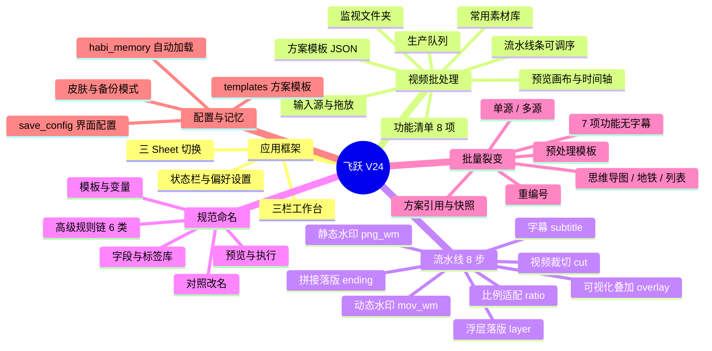

# 飞跃视频批处理 V24 · 功能思维导图

> 基于 `video_batch_tool_v24.py` 及 v20–v23、`ui/`、`modules/`、`naming_tool.py` 梳理。  
> 括号内为功能 **key** / **enable_key**。

---

## 总览



---

## 1. 应用框架与导航

### 1.1 顶栏 Sheet

| Sheet | 说明 | 嵌入组件 |
|-------|------|----------|
| **视频批处理** | 主工作台 | `ThreeColumnLayout` |
| **规范命名** | 成片规范改名 | `NamingToolApp` |
| **批量裂变** | 多方案连跑 | `FissionMindmapPanel` |

- 切到规范命名 → 自动对齐上次裂变/批处理输出目录
- 批处理/裂变完成 → 可选提示跳转规范命名

### 1.2 三栏工作台

```
┌─────────────┬──────────────────────┬─────────────┐
│   左栏      │        中栏          │    右栏     │
├─────────────┼──────────────────────┼─────────────┤
│ 输入源      │ 流水线条             │ 输出路径    │
│ 方案模板    │ 预览画布 + 时间轴    │ 规范命名入口│
│ 功能清单    │ 功能设置栈（动态）   │ 生产队列    │
│ 常用素材库  │                      │ 监视文件夹  │
│ 预览快捷    │                      │ 日志/进度   │
│             │                      │ 开始处理    │
└─────────────┴──────────────────────┴─────────────┘
```

### 1.3 底部状态栏

- 当前方案名（`template_var`）
- 已启用功能计数
- 运行状态 + 进度条
- **设置** → 偏好（记忆空间 / 皮肤 / 自动加载）

---

## 2. Sheet：视频批处理

### 2.1 左栏

#### 输入源

- 选择输入文件夹 / 拖放文件夹（`folder_drop`）
- 输入树：文件夹 / 视频 + 大小统计
- 选中视频 → 切换预览源

#### 方案模板

- 下拉选择 / 加载 JSON 模板（`templates/*.json`）
- **保存** / **删** / 刷新列表
- 启动自动加载（记忆：`batch_autoload`）
- 各方案配置独立存储，切换时缺省字段按默认值重置

#### 功能清单（`_FEATURE_SPECS`）

勾选启用；**新勾选置顶**到中间设置区。

| key | 名称 | enable_key |
|-----|------|------------|
| `cut` | 视频裁切 | `cut_enable` |
| `ratio` | 比例适配 | `ratio_enable` |
| `mov_wm` | 动态水印 | `enable_mov_watermark` |
| `png_wm` | 静态水印 | `png_wm_enable` |
| `layer` | 浮层落版 | `layer_enable` / `logo_enable` |
| `ending` | 拼接落版 | `ending_enable` |
| `overlay` | 可视化叠加 | `overlay_enable` |
| `subtitle` | 字幕 | `subtitle_enable` |

#### 常用素材（`asset_library`）

- **＋ 导入素材**（PNG/JPG/MOV/MP4 等）
- 存储模式：`copy` 复制进软件 / `reference` 只引用原路径
- 资产卡片：一键套到水印/落版/叠加/MOV、删除
- 失效检测与重新导入提示

#### 预览快捷

- **实时预览**（`preview_first_video`）
- 预览时段：智能 / 前3秒 / 结尾3秒 / 中间3秒

---

### 2.2 中栏 · 流水线

#### 流水线条（`pipeline_bar`）

- 按顺序展示已启用步骤（可点击跳转对应设置）
- **调整处理顺序**（`open_pipeline_order_editor`）
- 默认顺序：

```
cut → ratio → mov_wm → png_wm → layer → ending → overlay → subtitle
```

#### 视频预览画布

- 折叠开关（记忆：`preview_panel_open`）
- 帧预览 @ 指定秒数 / 选视频 / 刷新
- 时间轴拖拽 + 裁切范围可视化
- 叠加水印/PNG/落版等效果的合成预览
- 双击 → 放大预览

---

#### 功能设置详情

##### A. 视频裁切（`cut`）

- 范围：固定时段 / 末尾N秒（`cut_range_mode`）
- 模式：保留 / 删除（`cut_mode`）
- 参数：开始/结束时间 或 末尾秒数（`cut_tail_sec`）

##### B. 比例适配（`ratio`）

- 目标比例：9:16 / 4:5 / 1:1 / 16:9（`ratio_target`）
- 背景模糊强度 5–50（`ratio_blur_strength`）

##### C. 动态水印（`mov_wm`）

- AE 透明 MOV 文件（`mov_watermark_path`）
- 模式：全屏贴合 / 自定义位置（`mov_watermark_mode`）
- **预览并定位**（拖拽坐标 X/Y/W/H）
- 持续秒，0=全程（`mov_watermark_duration`）
- **颜色保护**（去发灰/发黑，`mov_color_protect`）

##### D. 静态水印（`png_wm`）

- PNG 文件（`png_wm_path`）
- 模式：全屏 / 自定义位置 + 九宫格位置
- 坐标 X/Y/W/H
- 显示时段：全程 / 指定秒段（`png_wm_time_mode`）

##### E. 浮层落版（`layer`）

- 模式：结尾覆盖落版（覆盖+拼接）
- 落版文件 / 尺寸% / 位置 / 自定义 X/Y
- 结尾前 N 秒开始叠加（`ending_trim`，时间轴 `TimelineCanvas`）
- 保留落版音频（重叠混合，`overlay_keep_audio`）

##### F. 拼接落版（`ending`）

- 落版视频拼接到主视频末尾（与浮层落版不同）
- 保留落版音频（`ending_keep_audio`）
- 截取落版前 N 秒，0=完整拼接（`ending_concat_trim`）

##### G. 可视化叠加（`overlay`）

- 叠加编辑器（`open_overlay_editor`）
- 图层：底图 / 视频素材 / Logo（`overlay_state`）
- 单视频单独定位 / 缩放 / 时段
- **叠加批量** / 编辑器内上一/下一视频预览

##### H. 字幕（`subtitle`）— V24 流水线步

**模式 A：AI 识别/翻译 → SRT**

- Whisper 源语言 / 目标语言
- 模型：tiny ~ large-v3
- 输出：仅原语言 / 仅翻译 / 双语并存 / 双文件

**模式 B：外部 SRT → 烧录**

- SRT 来源：与视频同目录 / 指定文件夹 / **固定 SRT（应用到所有视频）**
- 烧录字体：扫描本机字体 · 推荐/检测/刷新 · 黑底预览

---

### 2.3 右栏

#### 输出路径

- 输出文件夹 / 裂变输出根
- 选择 / 打开 / 清空
- 输出预览说明

#### 生产队列（`_job_queue`）

- **＋批处理** / **＋裂变** 加入当前任务
- 暂停 / 停止 / **开始队列** / 清空
- 失败重试：0–3 次
- 任务列表：状态 / 输入 / 输出

#### 监视文件夹（Watch Folder）

- 监视目录 + 输出根
- **扫描入队** / **开始监视** / 停止
- 轮询间隔（秒）；新子文件夹 → 自动入队

#### 批处理控制

- **开始处理** / **暂停/继续** / **停止**
- 同名冲突：跳过 / 覆盖 / 自动重命名
- 批处理完成 → 可选跳转规范命名

---

## 3. Sheet：规范命名

### 3.1 素材与扫描

- 文件夹路径 / 浏览 / 扫描
- **含子文件夹** 开关
- 拖放：文件夹 / 单/多文件
- 模板序号起始 + 位数（1/2/3）

### 3.2 命名模板

- 中间段模板编辑 + 原扩展名
- 插入变量：序号、品牌、语言、类型、标签1–3、尺寸、日期、设计师
- 重置默认 / **保存预设** / 加载预设
- 完整模板预览

### 3.3 字段设置

- 品牌 / 语言 / 类型 / 尺寸 / 日期（4/8位）/ 设计师
- 各字段预设 + 自定义 + **编辑** 选项库
- 标签 1–3 + 按类型常用标签库

### 3.4 预览与执行

- 预览表：勾选 / 原文件名 / 新文件名 / 备注
- 手动改名单条 / 锁定 / 解除锁定
- **刷新** / **执行重命名** / **应用规则**
- 撤销 / 重做（Ctrl+Z/Y）
- **打开文件夹** / **对照改名…**（源↔目标双栏）

### 3.5 高级规则链（`RenameRuleBlocksPanel`）

| 规则 | key | 说明 |
|------|-----|------|
| 添加与补齐 | `add` | 前缀/后缀/序号补齐 |
| 替换 | `replace` | 文本替换 |
| 删除与保留 | `delete` | 删段/保留段 |
| 移动 | `move` | 片段移动 |
| 字母大小写 | `case` | 大小写转换 |
| 旧版清理 | `legacy` | 解析非标准标签 |

### 3.6 与批处理/裂变联动

- 批处理页 / 裂变页一键跳转并指向输出根
- 子文件夹扫描模式（裂变多方案输出）

---

## 4. Sheet：批量裂变

### 4.1 模式与视图

| 维度 | 选项 |
|------|------|
| 素材模式 | **单源** / **多源**（`fission_io_mode`，最多 10 组） |
| 视图 | **思维导图** / **地铁线路** / **列表** |

### 4.2 单源流程

```
输入文件夹 → [可选预处理] → 方案A/B/C… → 输出根/方案名/
```

- 左栏：输入文件夹列表（添加/拖放/排序）
- 可选 **预处理**（`preprocess_enable`）
  - 预处理模板 / 成品目录（保留 / 指定 / 自动清理）
- 中间画布：多方案分支
- 右栏：输出根 / 跟随预处理

### 4.3 多源流程

- 源组卡片：输入 / 输出根 / 可选预处理 / 勾选方案子集
- 组间**串行**执行

### 4.4 方案（分支）管理

- 画布：双击空白添加 / 单击选中 / 右键菜单
- **新建方案** / **保存组合** / **加载组合**（`fission_plans/*.json`）
- 引用模板 / 克隆 / 自建快照 / 启停 / 拖拽调序
- 每方案 = 一套完整工作流 → `{输出根}/{方案名}/`

### 4.5 方案内功能（`_FUNC_DEFS`，无字幕）

| enable_key | 显示名 | jump_key |
|------------|--------|----------|
| `cut_enable` | 视频裁切 | `cut` |
| `ratio_enable` | 比例适配 | `ratio` |
| `enable_mov_watermark` | 动态水印 | `mov_wm` |
| `png_wm_enable` | 静态水印 | `png_wm` |
| `logo_enable` | 浮层落版 | `layer` |
| `ending_enable` | 拼接落版 | `ending` |
| `overlay_enable` | 可视化叠加 | `overlay` |

- 功能库勾选 + ↑↓ 调整裂变内处理顺序（`_fission_func_order`）
- 点子功能 → 细节弹窗（与批处理参数对齐）
- **跳到批处理页** 编辑复杂项（如可视化叠加）

### 4.6 裂变执行

- **开始处理** / 暂停 / 停止
- 进度：阶段 / 文件 / 百分比
- 路径预检（素材空/无效拦截）
- **重编号**：共享盘序号接续
- 完成后：可选提示打开规范命名

---

## 5. 方案模板与配置

### 5.1 方案模板（`templates/*.json`）

- 保存当前全部勾选 + 路径 + 参数
- 加载 / 删除 / 刷新
- 用途：批处理一键套用、裂变引用、预处理模板、自动加载
- 保存/删除后 → 裂变预处理模板列表**热更新**（无需重启）

### 5.2 批处理配置（`save_config` / `load_config`）

- 持久化当前界面状态到配置文件
- 与模板 JSON 独立

### 5.3 记忆空间（`habi_memory`）

| 记忆项 | 说明 |
|--------|------|
| `default_tab` | 默认打开页 |
| `default_view` | 裂变默认视图 |
| `default_theme` | 界面皮肤 |
| `batch_autoload` | 批处理自动加载模板 |
| `fission_autoload` | 裂变自动加载模板/组合 |
| `pipeline_order` | 流水线自定义顺序 |
| `preview_panel_open` | 预览面板折叠状态 |
| 窗口几何 | 位置与大小 |

---

## 6. 偏好设置

### 6.1 常规

- 默认打开页面：视频批处理 / 规范命名 / 批量裂变
- 批处理默认加载：无 / 上次 / 指定模板
- 界面皮肤（全应用共用，即时预览）

### 6.2 批量裂变

- 裂变自动加载：无 / 上次模板 / 方案模板 / 方案组合
- 默认输出根路径
- 裂变默认视图：思维导图 / 地铁线路 / 列表
- 命名格式占位符（`{scheme}_{date}_{index}` 等）
- 裂变完成后提示打开规范命名

### 6.3 高级

- 显示操作提示
- **备份模式**（批处理前备份输出目录 → 支持撤销上次批处理）
- 还原本页选项 / 清空记忆空间

---

## 7. UI 与主题

### 7.1 皮肤（`APP_SKIN_LABELS`）

- 简约工作台 / 奶油 / 蓝 / 绿 / 暗色 / 无主题（经典灰）
- 功能色条（`FEATURE_ACCENT`）按模块着色

### 7.2 交互

- 功能勾选 ↔ 流水线条 ↔ 设置面板 三方联动
- 流水线步骤点击跳转（`_jump_to_feature`）
- 素材路径缺失 → 开跑前拦截清单
- 文件夹拖放（输入源 / 命名页 / 裂变页）
- 可折叠区块（队列 / 监视 / 预览 / 命名规则）
- Mac/Win 文案适配（`platform_utils`）

---

## 8. 典型工作流

### 8.1 单方案批处理

```
输入 → 套模板 → 勾选功能 → 设参数 → 开始处理 → 规范命名
```

### 8.2 多方案裂变

```
单/多源 → 画布加方案 → 配功能 → 输出根 → 开始处理 → 规范命名（含子文件夹）
```

### 8.3 无人值守

```
监视文件夹 → 扫描/轮询入队 → 开始队列（批处理 + 裂变混排）
```

### 8.4 模板驱动

```
保存方案 → 偏好自动加载 → 资产库一键套素材
```

---

## 9. 引擎保留、V24 主 UI 未直接暴露

| 能力 | 说明 |
|------|------|
| 音频工具箱 | `open_audio_toolbox`（v20/v21 入口） |
| 画质增强 `enhance` | v22 有，V24 `_FEATURE_SPECS` 未纳入 |
| 全局输出后缀模式 | v21 `build_global_io`，V24 改为冲突弹窗 |

---

## 附录：文件入口速查

| 模块 | 主要文件 |
|------|----------|
| V24 主程序 | `video_batch_tool_v24.py` |
| 批处理引擎 | `video_batch_tool_v21.py` |
| 模板/配置基类 | `video_batch_tool_v20.py` |
| 裂变引擎 | `video_batch_tool_v23.py` |
| 裂变 UI | `ui/fission_mindmap_tab.py` |
| 命名工具 | `naming_tool.py` |
| 字幕 | `modules/subtitle_engine.py` |
| 水印 | `core/watermark.py` |
| 方案模板目录 | `templates/*.json` |
| 裂变组合 | `fission_plans/*.json` |

---

*文档版本：V24 · 2026-08*
